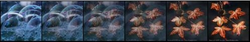
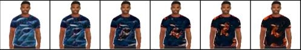
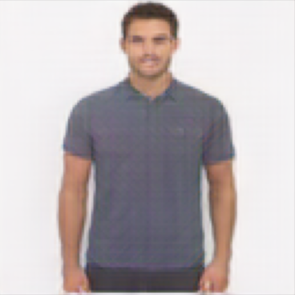
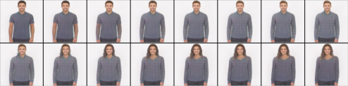
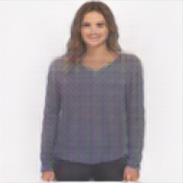
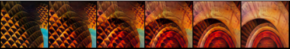

# Creative Fashion Design System
This is the official repository for the paper "Computational Creative Systems in Design: The Case of Fashion Design Systems", providing the code for a prototype of a computational creative system for fashion design. It combines two variational autoencoder, one for garment shape generation and one for creative garment style generation. The resulting shapes and styles are syntehsized to a comprehensive design using style transfer. 


## Installation

### 1. Clone the repositiory
To run the code, use the following command to clone the repository:
```diff
git clone https://github.com/CreativeFashionVAE/CreativeFashionDesign.git
```

### 2. Install the requirements
Python: 3.9

Torch: 1.11

```diff
pip install -r requirements.txt
```


### 3. Set up datasets and pretrained weights
This repository requires multiple (preprocessed) datasets and weights for the pretrained models. Please download the following files to test and use our pretrained fashion design system: 
https://drive.google.com/drive/folders/1SUzxFiTak5iVn4V3vVNkAlnb4a_vY0bx?usp=sharing

Datasets: 
- apply_data_styles
- apply_data_shapes
- preprocessed_data_shapes (used for attribute conditioning)

Weights: 
- Shape VAE: weights_shapeVAE.tar
- Style VAE: weights_styleVAE.tar

To run the code, all the zip files have to be downloaded and moved to the 'data' folder. The datasets can be extracted with the following command:
```diff
python ./Main.py --unzip True
```
If you want to train your own models, please download the complete datasets from their official websites and use our provided preprocessing script: 
- MVC Fashion Dataset: https://mvc-datasets.github.io/MVC/
- ImageNet Dataset: https://www.image-net.org/ 


## Garment design generation 
To generate a novel garment design, you can run the following command: 

```diff
python ./Main.py --generation_type Full 
```
<p align="center">
  
</p>
<p align="center">
  
</p>

This command reconstructs a random garment shape, creates a style from two randomly selected style images, and synthesizes them to a final garment design using style transfer. 


## Shape generation
You can also generate a garment shape individually using the following command: 

```diff
python ./Main.py --unzip False --generation_type Shape
```

There is various ways to steer the garment shape generation. 

You can not only use a random reconstruction, but also sample a random new garment shape or use a preselected one as follows: 

--shape_generation: choices=['randomReconstruction', 'selectedReconstruction', 'randomSample']

If you choose 'selectedReconstruction', you additionally are able to specify the path of your selected garment shape using --shape_file

```diff
python ./Main.py --unzip False --generation_type Shape --shape_generation selectedReconstruction --shape_file 1114700_0.jpg
```

You can additionally specify shape-related characteristics as attributes to the garment shape generation. 

You can specify the sleeve length as follows:

--sleeve_length: choices=[ShortSleeves, LongSleeves, TankTops, Sleeveless]. 

You can specify the garment type as follows:

--garment_type: choices=[ButtonUpShirts, Buttondown, Crew, Pullover, Vneck, Blouses, Raglan, Workout, Athletic, TShirts]

```diff
python ./Main.py --unzip False --generation_type Shape --shape_generation selectedReconstruction --gender Womens --sleeve_length LongSleeves --garnment_type Vneck
```
    


## Style generation process
You can also generate a garment style individually using the following command: 

```diff
python ./Main.py --generation_type Style
```

You can either use random inspirational sources or preselected ones as follows: 

--style_images: choices=['Random', 'Selected']

If you choose 'Selected', you additionally are able to to specify the style images' paths using --style1 and --style2.

You can also specify how many interpolation steps you want to create between the inspirational sources using --interpolation_steps. 

```diff
python ./Main.py --unzip False --generation_type Style --style_images Selected --style1 "abstract_brown (5).jpg" --style2 "abstract_brown (39).jpg" --interpolation_steps 6
```

<p align="center">
  
</p>

## Retraining the model
To retrain either the pattern model or the shape model, execute one of the following commands:
```diff
python ./Main.py --train Shape
```
```diff
python ./Main.py --train Style
```


# Implementation References
Variational Autoencoder:
- https://github.com/NVlabs/NVAE
- https://github.com/GlassyWing/nvae


